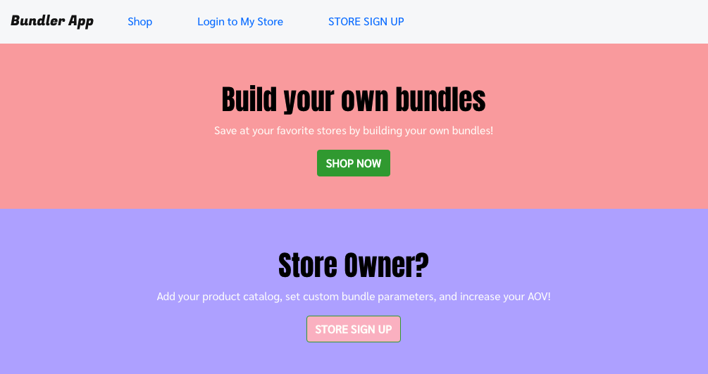
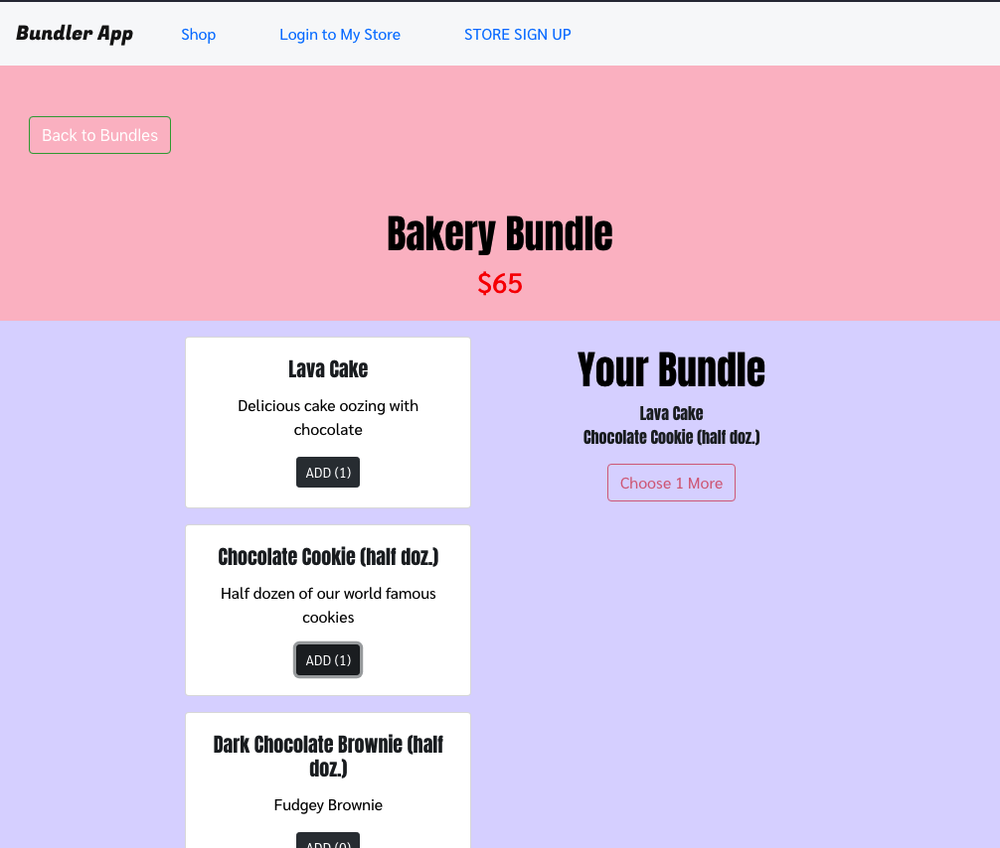
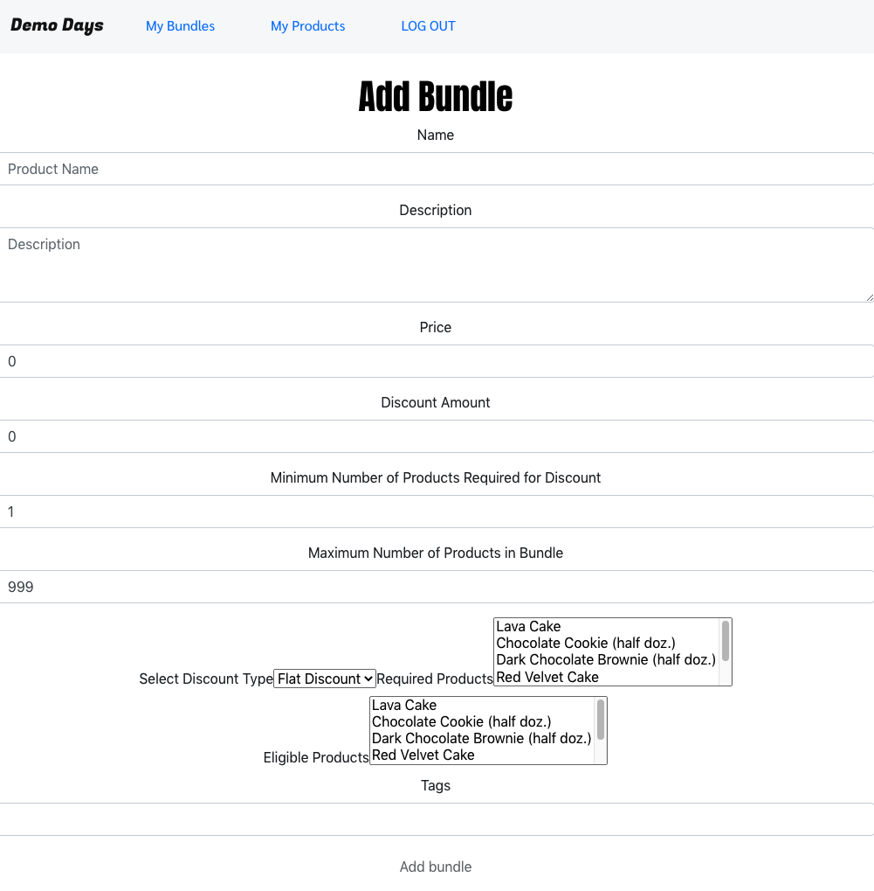

# Bundle Builder

Create custom product bundles for your products.

A MERN web app featuring a basic store admin, shop pages, and a bundle builder.

A store can sign up and add their product catalog, then set a build-it-yourself bundle for their customers.

Shoppers can browse the stores and build their own bundles.

## [Launch App](https://product-bundle-builder.herokuapp.com/)

## App Screenshots

## Technologies Used

- MongoDB + Mongoose
- Express
- React
- Node
- JWT Auth
- bcrypt
- HTML, CSS, & Bootstrap
- Deployed on Heroku

## Getting Started

Stores: Sign up or login. Add products and create product bundles.
Shoppers: Browse your favorite stores. Choose your desired bundle and build it.

## Planned Features

- Implement Order model
- Pass orders to store model
- Update deployed styling
- Allow stores to update and delete bundles
- Add product images
- Implement price calculation based on bundle details
- Allow shopper to remove items from bundle

## [Wireframe, ERD, Project Management](https://www.notion.so/7ddc6a2c6bbe46c6a1da9c840bdd5012?v=902512f7371a4b49a363a7b4bb745a77)
